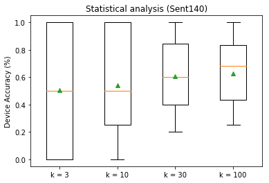

<h1> Twitter Sentiment Analysis </h1>

In this experiment, we reproduce the statistical analysis experiment conducted in the [LEAF paper](https://arxiv.org/abs/1812.01097). Specifically, we investigate the effect of varying the minimum number of 
samples per user (for training) on model accuracy when training using `FedAvg` algorithm,
using the LEAF framework. 

For this example, we shall use Sentiment140 dataset (containing 1.6 million tweets),
and we shall train a 2-layer LSTM model with cross-entropy loss, and using pre-trained GloVe embeddings.

# Experiment Setup and Execution

## Quickstart script

In the interest of ease of use, we provide a script for execution of the experiment
for different min-sample counts, which may be executed as:

```bash
leaf/paper_experiments $> ./sent140.sh <result-output-dir>
```

This script will execute the instructions provided below for min-sample counts of 3, 10, 30 and 100, reproducibly generating the data partitions and results observed by the authors during analysis.

## Pre-requisites

Since this experiment requires pre-trained word embeddings, we recommend running the
`models/sent140/get_embs.sh` file, which fetches 300-dimensional pretrained GloVe vectors.
```bash
leaf/models/sent140/ $> ./get_embs.sh
```
After extraction, this data is stored in `models/sent140/embs.json`.

## Dataset fetching and pre-processing

LEAF contains powerful scripts for fetching and conversion of data into JSON format for easy utilization.
Additionally, these scripts are also capable of subsampling from the dataset, and splitting the dataset
into training and testing sets.

For our experiment, as a first step, we shall use 50% of the dataset in an 80-20 train/test split,
and we shall discard all users with less than 10 tweets. The following command shows
how this can be accomplished (the `--spltseed` flag in this case is to enable reproducible generation of the dataset)

```bash
leaf/data/sent140/ $> ./preprocess.sh --sf 0.5 -t sample -s niid --tf 0.8 -k 3 --spltseed 1549775860
```

After running this script, the `data/sent140/data` directory should contain `train/` and `test/` directories.

## Model Execution

Now that we have our data, we can execute our model! For this experiment, the model file is stored
at `models/sent140/stacked_lstm.py`. In order train this model using `FedAvg` with 2 clients every round for 10 rounds,
we execute the following command:

```bash
leaf/models $> python3 main.py -dataset sent140 -model stacked_lstm -lr 0.0003 --clients-per-round 2 --num-rounds 10
```

Alternatively, passing `-t small` in place of the latter 2 flags provides the same functionality (as defined in `models/baseline_constants.py` file).

## Metrics Collection

Executing the above command will write out system and statistical metrics to `leaf/models/metrics/stat_metrics.csv` and `leaf/models/metrics/sys_metrics.csv` - since these are overwritten for every run, we __highly recommend__ storing the generated metrics files at a different location.

To experiment with a different min-sample setting, re-run the preprocessing script with a different `-k` flag. The plots shown below can be generated using `plots.py` file in the repo root.

# Results and Analysis

Upon performing this experiment, we see that, while median performance degrades only slightly with data-deficient users (i.e., k = 3), the 25th percentile (bottom of box) degrades dramatically.

<div style="text-align:center" markdown="1">



</div>

# More Information

More information about the framework, challenges and experiments can be found in the [LEAF paper](https://arxiv.org/abs/1812.01097). 
